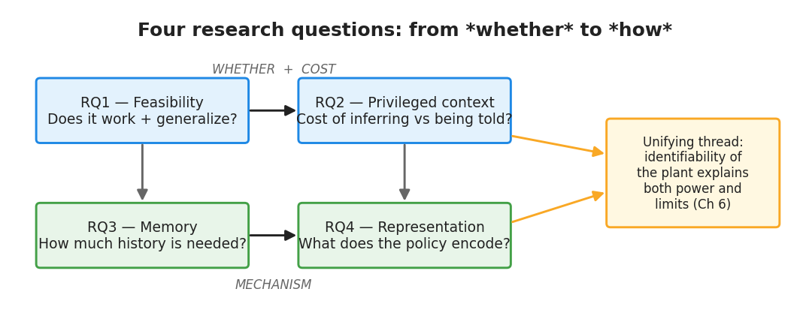

# Chapter 1 — Figures

Conceptual figures generated by `thesis_doc/scripts/make_chapter_diagrams.py`
(rerun to refine). An introduction benefits from exactly one strong orienting
figure (the graphical abstract) plus a roadmap; more than that competes with the
prose.

| Fig | Title | Status | §/where | Why it helps |
|-----|-------|--------|---------|--------------|
| 1.1 | Graphical abstract — hidden ψ → plant → PID, RL schedules gains, teacher vs student | ✅ generated | §1.2 (problem framing) | One picture that fixes the whole architecture and the teacher/student contrast before the reader hits the formalism |
| 1.2 | Research-question roadmap (RQ1–4, *whether → mechanism*) | ✅ generated | §1.3 (research questions) | Shows RQ1–2 establish feasibility/cost and RQ3–4 the mechanism, with the identifiability thread to Ch6 |
| 1.3 | Motivating real-world examples (AGV payload, drone battery/prop wear, manipulator inertia, drive torque drift) | 📐 author | §1.1 (motivation) | Grounds "hidden, uninstrumented parameter" in four concrete systems; an icon row makes the problem tangible. Best drawn with simple icons in Inkscape/draw.io |

**Embed snippets (generated figures):**
```markdown


*Figure 1.1 — The thesis at a glance: RL supervises a classical PID loop under hidden, randomized dynamics; teacher observes the parameters, student infers them.*
```
```markdown


*Figure 1.2 — Research-question roadmap: from whether the approach works to how the blind agent infers the dynamics.*
```
