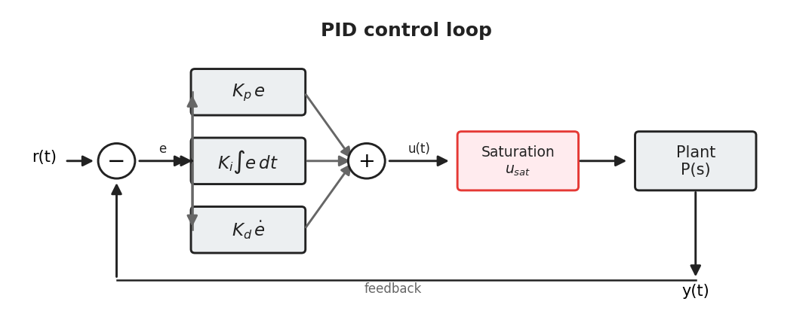
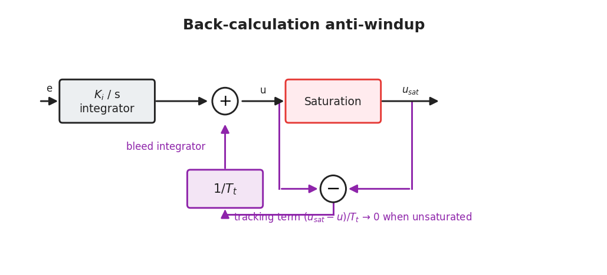
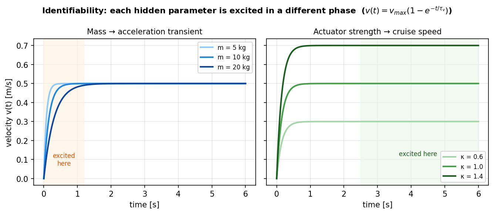

# Chapter 2 — Figures

Background is the most figure-hungry chapter: every standard mechanism it
recaps (PID, windup, anti-windup, PPO clip, identifiability) reads far better as
a diagram. Five are generated by `make_chapter_diagrams.py`.

| Fig | Title | Status | §/where | Why it helps |
|-----|-------|--------|---------|--------------|
| 2.1 | PID control-loop block diagram (+ saturation) | ✅ generated | §2.1 | Anchors the control law $u=K_pe+K_i\int e+K_d\dot e$ visually; the saturation block sets up §2.2 |
| 2.2 | Integral-windup mechanism (error / integral / saturated command vs time) | ✅ generated | §2.2 | Makes the worked example ($I\approx17.5$ vs derivative authority $0.25$) legible — the core of the fair-baseline argument |
| 2.3 | Back-calculation anti-windup block diagram | ✅ generated | §2.2 | Shows the tracking term $(u_{sat}-u)/T_t$ bleeding the integrator — why two lines of code fix windup |
| 2.4 | PPO clipped surrogate ($L^{CLIP}$ vs ratio, $A>0$ and $A<0$) | ✅ generated | §2.4.2 | The canonical PPO figure; shows the gradient vanishing outside $[1-\epsilon,1+\epsilon]$ |
| 2.5 | Identifiability: $v(t)=v_{max}(1-e^{-t/\tau_v})$, mass→transient vs actuator→cruise | ✅ generated | §2.4.5 | Visual prediction of the RQ4 double dissociation, straight from the ODE — ties theory to the Ch5 probe |
| 2.6 | HiP-MDP / teacher–student formal schematic (family $\mathcal M_\psi$, per-episode draw, teacher sees ψ / student sees history) | 📐 author | §2.4.4 | A formal companion to Fig 1.1; useful if §2.4.4 should stand alone. Partly redundant with 1.1 — only add if the formal MDP framing needs its own picture |
| 2.7 | Adaptive-control design space (gain scheduling vs self-tuning vs MRAC vs learned: what each *requires*) | 📐 author | §2.3 / §2.6 | A 2×2 or table-figure of assumptions (measurable scheduling var? model? sensitivity sign?) that positions the contribution and the "gap" |
| 2.8 | GAE bias–variance vs λ | 🔶 generatable | §2.4.3 | Minor; only if §2.4.3 needs illustration. Easy to add to the script |

**Embed snippets (generated):**
```markdown

*Figure 2.1 — The PID control loop with actuator saturation.*

![Integral windup: with the error one sign through a ~10 s saturated approach, the integral accumulates to ≈17.5 — far beyond the [-1,1] command range — so the loop overshoots and the integrator must unwind before recovery.](figures/fig2_2_windup.png)
*Figure 2.2 — Integral windup on an input-saturated approach (schematic).*


*Figure 2.3 — Back-calculation anti-windup.*

![PPO clipped surrogate L^CLIP versus the probability ratio for positive and negative advantage; once the ratio leaves [1−ε, 1+ε] the objective flattens and the sample's gradient vanishes.](figures/fig2_4_ppo_clip.png)
*Figure 2.4 — The PPO clipped surrogate.*


*Figure 2.5 — Each hidden parameter is excited in a different phase of the trajectory.*
```
