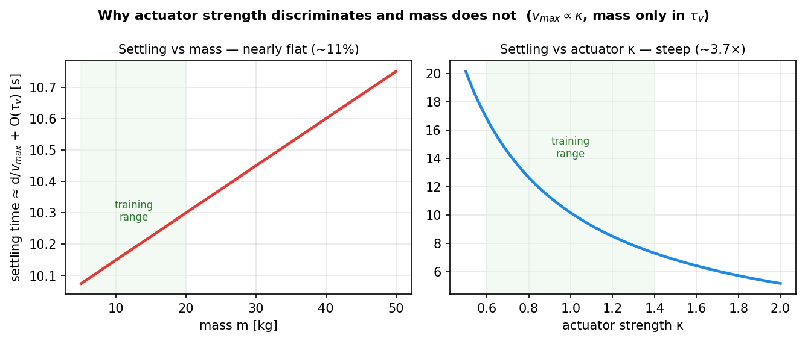
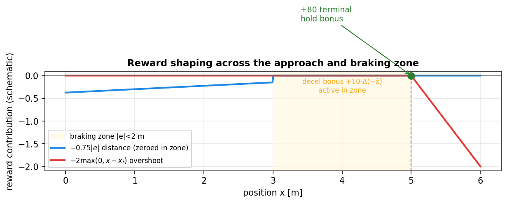
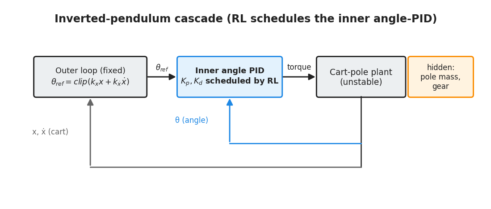

# Chapter 3 — Figures

Four diagrams (3.1–3.4) are generated by `make_diagrams.py` and **already
embedded** in `chapter3_methodology.md`. Three more (3.5–3.7) are generated by
`make_chapter_diagrams.py` and are **not yet embedded** — snippets below.

| Fig | Title | Status | §/where | Why it helps |
|-----|-------|--------|---------|--------------|
| 3.1 | Two-loop control architecture | ✅ embedded | §3.1 | — |
| 3.2 | Car task schematic (friction patch, braking zone, hold band) | ✅ embedded | §3.2 | — |
| 3.3 | Curriculum schedule | ✅ embedded | §3.5 | — |
| 3.4 | Actor–critic network | ✅ embedded | §3.4 | — |
| 3.5 | Terminal-speed analysis: settling vs mass (flat ~11%) vs actuator (steep ~3.7×) | ✅ generated | §3.2 | Visual proof that $v_{max}\propto\kappa$ and mass-only enters $\tau_v$ — the quantitative reason the actuator axis discriminates and mass does not |
| 3.6 | Reward shaping across approach and braking zone | ✅ generated | §3.2 (reward) | Shows progress/distance zeroed in the zone, overshoot penalty past target, terminal bonus — clarifies the heavily-shaped reward table |
| 3.7 | Inverted-pendulum cascade (outer cart loop + inner RL-scheduled angle PID) | ✅ generated | §3.8 | The cascade is described but not drawn; this makes "RL schedules only the inner gains" concrete |
| 3.8 | Cart-pole plant schematic (x, θ, randomized pole mass & gear) | 📐 author | §3.8 | A simple labelled cart-pole; pairs with 3.7. Inkscape/TikZ |
| 3.9 | MuJoCo renders of both plants (car, cart-pole) | 🔶 generatable | §3.2 / §3.8 | A real `env.render(mode="rgb_array")` screenshot of each plant adds concreteness a schematic cannot. Render from `envs/adaptive_suspension.py` and `envs/adaptive_pendulum.py` |

**Embed snippets (generated, not yet embedded):**
```markdown

*Figure 3.5 — Why actuator strength discriminates controllers and mass does not.*  → place in §3.2 after the terminal-speed derivation


*Figure 3.6 — Reward shaping across the approach and braking zone.*  → place in §3.2 after the reward table


*Figure 3.7 — The inverted-pendulum cascade; RL schedules only the inner-loop gains.*  → place in §3.8
```

> Note: 3.5 is the analytical prediction; Ch5's `fig5_mass_sweep.png` is the
> measured confirmation. Cite 3.5 → 5.8 (mass sweep) to close the loop.
