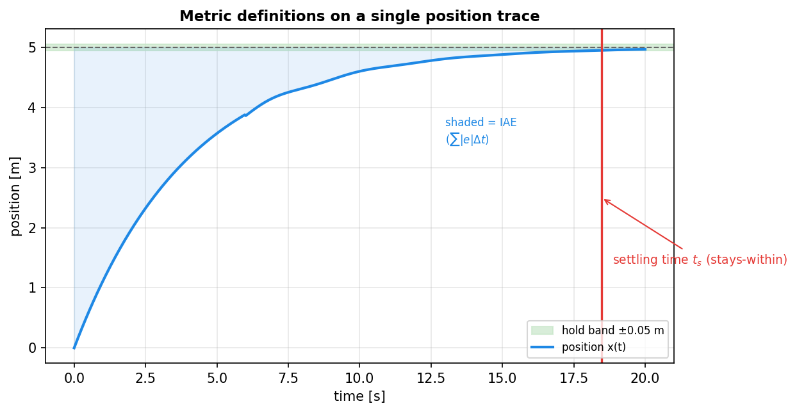
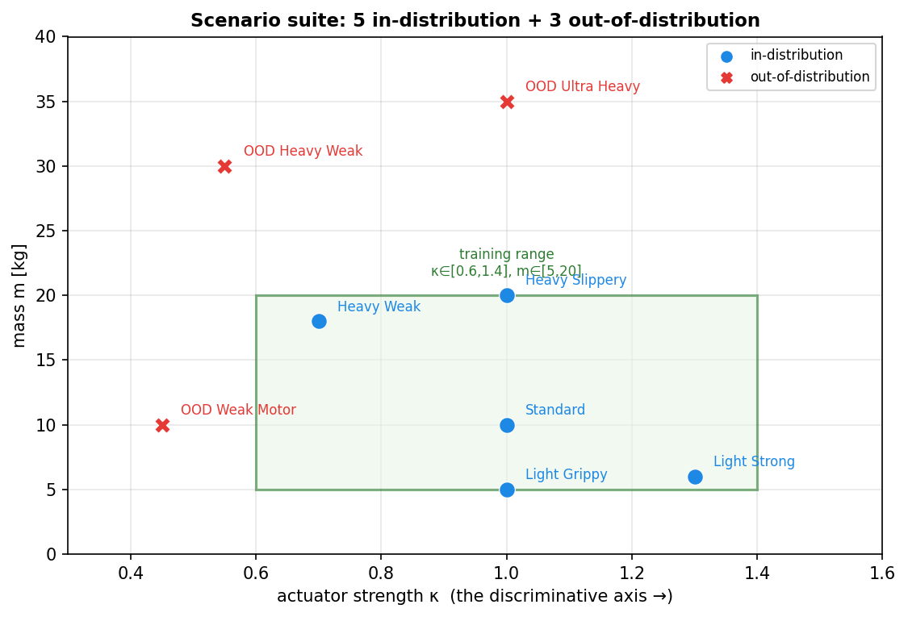

# Chapter 4 — Figures

Two generated by `make_chapter_diagrams.py`; both are high-value because the
chapter's content (scenario design, metric definitions) is inherently spatial.

| Fig | Title | Status | §/where | Why it helps |
|-----|-------|--------|---------|--------------|
| 4.1 | Metric definitions on one annotated position trace (settling, overshoot, hold band, IAE) | ✅ generated | §4.1.1 | Defines every metric visually on a single trace — far clearer than five prose definitions |
| 4.2 | Scenario-suite map in (actuator × mass) space, training box + OOD corners | ✅ generated | §4.2 | Turns the 8-row scenario table into a picture: shows the 5 in-distribution points, the 3 OOD extrapolation directions, and why the suite spans the discriminative axis |
| 4.3 | Protocol v1 vs v2 (byte-identical repeats / zero variance vs genuine per-episode physics+target jitter) | 📐 author | §4.1 | Illustrates the audit fix that gave honest variance; a small before/after schematic. Could be scripted (two strips of sample episodes) |
| 4.4 | Nested variance structure (5 seeds × 10 episodes × scenario, reported separately) | 📐 author | §4.4 | Clarifies the seed-level statistics and why $n_s=5$ drives wide CIs |

**Embed snippets (generated):**
```markdown

*Figure 4.1 — Metric definitions on one position trace (success, settling time, overshoot, IAE).*


*Figure 4.2 — The eight-scenario suite: five in-distribution, three out-of-distribution along distinct extrapolation directions.*
```
